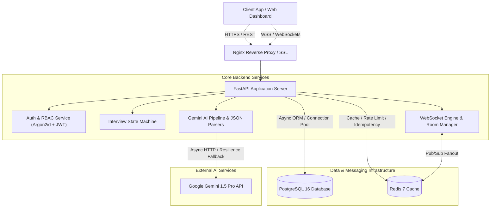

# AI-Powered Live Interview Platform Backend

[](https://www.python.org/)
[](https://fastapi.tiangolo.com/)
[](https://www.postgresql.org/)
[](https://redis.io/)
[](https://www.docker.com/)
[](https://ai.google.dev/)
[](LICENSE)

A production-grade, event-driven backend platform powering real-time AI technical interviews, automated answer grading, role-tailored question generation, and executive hiring analytics.

---

## 🌟 Architecture Overview



---

## 🚀 Key Capabilities

- **Real-Time WebSocket Engine**: Stateful interview rooms supporting live candidate streaming and recruiter oversight with Redis Pub/Sub multi-node horizontal scaling.
- **Asynchronous AI Question Generation**: Dynamically creates technical, system design, and behavioral questions matched to candidate skill profiles.
- **Automated Answer Evaluation**: Evaluates candidate responses against rubric criteria on technical depth, communication, and relevance.
- **Deterministic Hiring Analytics**: Aggregates section performance and calculates hiring recommendations (`STRONG_HIRE`, `HIRE`, `NEUTRAL`, `NO_HIRE`, `STRONG_NO_HIRE`).
- **Production Security & Hardening**: Argon2id password hashing, short-lived JWTs with Redis token rotation, brute force lockout penalties, rate limiting, and idempotency protection (`X-Idempotency-Key`).
- **Full Observability**: Structured JSON logging (`structlog`), request correlation tracing (`X-Request-ID`), health/readiness endpoints, and Prometheus metrics (`/metrics`).

---

## 🏗️ Tech Stack

| Domain | Technology |
| :--- | :--- |
| **Language & Runtime** | Python 3.12+ (AsyncIO, Type Annotations) |
| **Framework** | FastAPI, Starlette, Pydantic v2, Pydantic Settings |
| **Database & ORM** | PostgreSQL 16, Async SQLAlchemy 2.0, Alembic Migrations |
| **Caching & Messaging** | Redis 7 Cluster (Cache-Aside, Rate Limiting, Pub/Sub Backplane) |
| **AI Integration** | Google Gemini API (`gemini-1.5-pro`), Structured JSON Parsers |
| **Real-Time Communication** | FastAPI WebSockets, Custom ConnectionManager, Heartbeat Ping/Pong |
| **Security & Auth** | Argon2id Hashing (`passlib`), PyJWT, Redis Token Rotation & Revocation |
| **Observability** | Structured JSON Logging, Prometheus Metrics (`/metrics`), Correlation IDs (`X-Request-ID`) |
| **DevOps & Infrastructure** | Docker Multi-stage, Docker Compose, Nginx (SSL/TLS 1.3), GitHub Actions CI/CD |

---

## ⚡ Quick Start & Local Setup

### 1. Prerequisites
- Python 3.12+
- Docker & Docker Compose
- PostgreSQL 16 & Redis 7 (or run via Docker Compose)

### 2. Environment Setup
Clone the repository and copy the environment template:
```bash
git clone https://github.com/Raju3114/candidate-assessment-engine.git
cd candidate-assessment-engine
cp .env.example .env
```

### 3. Running with Docker Compose (Recommended)
```bash
docker-compose up --build
```
The server will start at `http://localhost:8000`.

### 4. Running Locally (Development Mode)
```bash
# Create Virtual Environment
python -m venv .venv
source .venv/bin/activate  # On Windows: .venv\Scripts\activate

# Install Dependencies
pip install -r requirements.txt

# Run Database Migrations
alembic upgrade head

# Start Development Server
uvicorn app.main:app --reload --host 0.0.0.0 --port 8000
```

---

## 📡 Core API & WebSocket Endpoints

| Method | Endpoint | Description |
| :--- | :--- | :--- |
| `POST` | `/api/v1/auth/register` | User registration (Candidate / Recruiter) |
| `POST` | `/api/v1/auth/login` | Login with Argon2id hash & JWT issuance |
| `POST` | `/api/v1/auth/refresh` | Refresh token rotation |
| `GET` | `/api/v1/candidates` | Recruiter search & filter candidates by skill/experience |
| `POST` | `/api/v1/interviews` | Create new interview session |
| `POST` | `/api/v1/interviews/{id}/generate-questions` | Trigger AI question generation via Gemini API |
| `WS` | `/ws/interviews/{id}?token=<jwt>` | Stateful WebSocket live interview room endpoint |
| `GET` | `/api/v1/answers/{id}/evaluation` | Fetch AI evaluation score & qualitative feedback |
| `POST` | `/api/v1/interviews/{id}/generate-report` | Aggregate evaluations & calculate final hiring report |
| `GET` | `/health` | Liveness probe endpoint |
| `GET` | `/ready` | Readiness probe (PostgreSQL, Redis, Gemini API) |
| `GET` | `/metrics` | Prometheus metrics text exposition |

---

## 📚 Detailed Documentation Index

- 🏛️ [System Architecture & Scaling Strategy](docs/architecture.md)
- 🗄️ [Database Schema & ER Diagram](docs/database.md)
- ⚡ [WebSocket Real-Time Engine & Pub/Sub](docs/websocket.md)
- 🤖 [Gemini AI Engine & Prompt Parsers](docs/ai-engine.md)
- 🐳 [Production Deployment & Runbook](docs/deployment.md)
- 🎬 [5-Minute Live Project Demo Script](docs/demo_script.md)
- 💼 [Resume Bullet Points & Impact Statement](docs/resume_package.md)
- 🎯 [Interview Preparation & System Design Q&A](docs/interview_preparation_package.md)

---

## 📄 License

This project is open-source and available under the [MIT License](LICENSE).
