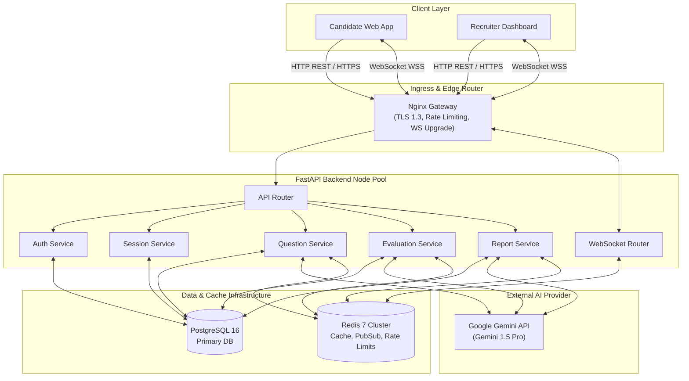
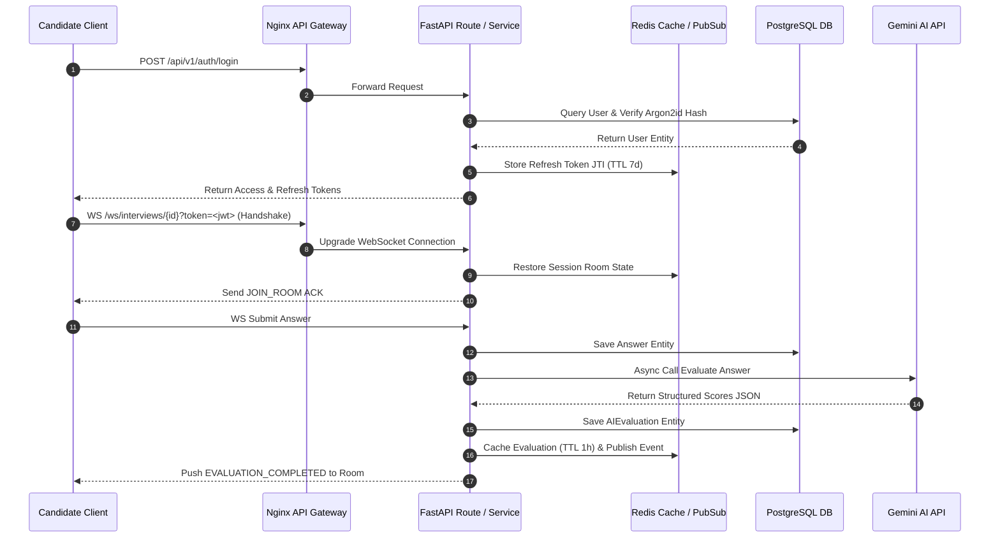
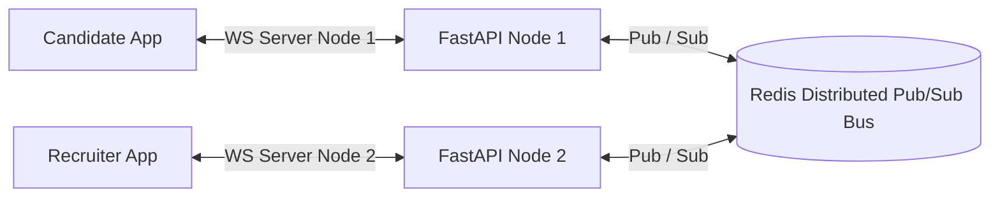

# System Architecture & Scaling Strategy

## 1. High-Level Architecture (HLD)

The platform follows **Clean Architecture** principles, enforcing separation of concerns between core domain entities, application use cases, infrastructure adapters, and web interfaces.

---

## 2. Request Lifecycle & Execution Flow

---

## 3. Redis Architecture & Use Cases

Redis 7 operates as the high-speed data backbone serving 4 critical functions:

1. **Active Session Caching (Cache-Aside)**:
   - Stores active question sequences and final reports (`report:{interview_id}`, TTL 6 hours).
2. **WebSocket Multi-Node Pub/Sub**:
   - Acts as a message bus across multiple FastAPI instances (`ws_channel:room:{interview_id}`).
3. **Sliding Window Rate Limiting**:
   - Enforces login limits (5/min), AI limits (20/hr), and global limits (100/min).
4. **JWT Revocation & Rotation**:
   - Blacklists revoked access token JTIs and enforces refresh token rotation.

---

## 4. Horizontal Scaling Strategy

By decoupling WebSocket message broadcasting through Redis Pub/Sub, client socket connections can scale horizontally across $N$ stateless FastAPI container instances behind Nginx or an AWS Application Load Balancer (ALB).
