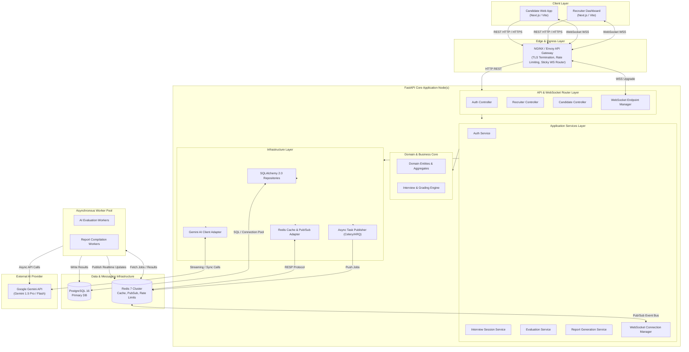
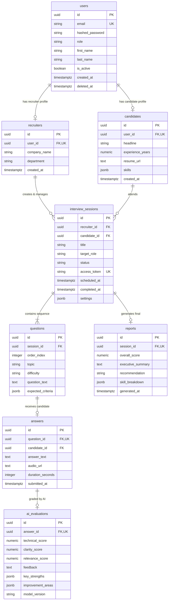
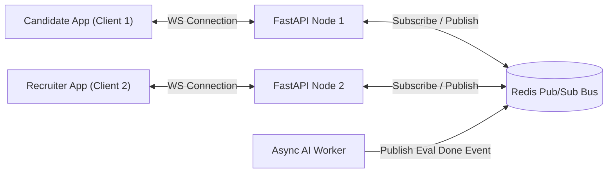

# AI Interview Platform Backend – System Architecture & Database Design Document

**Document Version:** 1.0.0  
**Author:** Principal Backend Architect  
**Status:** Approved for Implementation  
**Tech Stack:** Python 3.12+, FastAPI, PostgreSQL 16, Redis 7, WebSockets, Gemini API, SQLAlchemy 2.0, Alembic, Docker  

---

## Executive Summary

This document specifies the technical architecture, database schema, software design patterns, scalability strategies, and production engineering practices for the **AI Interview Platform Backend**. The system powers real-time, AI-driven candidate interviews, automated evaluations, recruiter analytics, and streaming interactive sessions.

The architecture emphasizes **Clean Architecture**, **Domain-Driven Isolation**, **Sub-second Real-Time Event Dispatching via WebSockets**, and **Asynchronous AI Orchestration** to handle heavy Gemini API inference latencies without blocking candidate experience.

---

## 1. High-Level Architecture (HLD)

### 1.1 High-Level Design (HLD)

The platform is designed as an event-driven modular monolith structured around clean layers, with clear upgrade paths to microservices if micro-scaling is required.



---

### 1.2 Component Breakdown & Responsibilities

| Component | Primary Responsibility | Key Tech / SLA |
| :--- | :--- | :--- |
| **API Gateway / NGINX** | SSL termination, CORS handling, client request routing, rate limiting per IP, WebSocket handshake sticky routing. | NGINX, SSL/TLS, p99 < 2ms |
| **Auth Controller & Service** | Manages registration, authentication (JWT access & refresh tokens), password hashing, role-based authorization (RBAC). | FastAPI, Passlib (Argon2id), PyJWT |
| **Interview Session Service** | Manages session lifecycle (SCHEDULED -> IN_PROGRESS -> COMPLETED), configures role requirements, difficulty, question queue. | Python 3.12, SQLAlchemy 2.0 |
| **WebSocket Connection Manager** | Handles real-time candidate-interviewer bidirectionality, socket lifecycle, ping/pong heartbeats, and room broadcasting via Redis Pub/Sub. | FastAPI WebSockets, Redis Pub/Sub |
| **AI Evaluation Service** | Constructs prompt context, formats rubric criteria, calls Gemini API with structured output schemas, and handles evaluation scores. | Gemini API SDK, Pydantic v2 |
| **Report Generation Service** | Compiles section performance, computes competency scores, generates executive summary reports and analytics. | Python 3.12, Jinja2 / PDF Engine |
| **Async Worker Pool** | Offloads long-running AI evaluations, report building, and audio transcription to avoid blocking HTTP/WS worker threads. | Celery / ARQ, Redis Broker |
| **PostgreSQL 16** | Primary relational datastore storing users, candidates, recruiters, sessions, questions, answers, evaluations, and reports. | PostgreSQL 16, PgBouncer |
| **Redis 7 Cluster** | Distributed cache for active sessions, user authorization tokens, rate limits, WebSocket pub/sub messaging channel, task queue storage. | Redis 7, hiredis |

---

### 1.3 Service Architecture & Request Lifecycle

#### A. Synchronous REST Request Lifecycle
```
Client -> API Gateway -> Auth Middleware -> Route Controller -> Service Layer -> Unit of Work -> Repository -> PostgreSQL DB
                                                                      |
                                                                Redis Cache Check (Cache-Aside)
```
1. **Client Request**: HTTPS Request carrying JWT Bearer token in headers.
2. **Gateway**: Validates rate limits and routes request to FastAPI instance.
3. **Auth Middleware**: Decodes JWT, validates signature, extracts claims (`user_id`, `role`), and populates request state.
4. **Controller (Route Handler)**: Validates incoming body using Pydantic schemas.
5. **Service Layer**: Executes domain logic within a transactional Unit of Work context.
6. **Repository Layer**: Queries PostgreSQL via SQLAlchemy 2.0 AsyncSession (or checks Redis cache).
7. **Response Transformation**: Converts domain entities to response DTOs and returns HTTP 200/201/4xx/5xx.

#### B. Real-Time WebSocket Interview Lifecycle
```
Client (Candidate)              FastAPI WS Endpoint           Redis Pub/Sub Bus          Async AI Worker            Gemini API
      |                                  |                            |                         |                       |
      |--- 1. WS Handshake (JWT) ------->|                            |                         |                       |
      |<-- 2. Connection Accepted -------|                            |                         |                       |
      |                                  |                            |                         |                       |
      |--- 3. Send Answer Text/Audio --->|                            |                         |                       |
      |                                  |--- 4. Save Answer (DB) --->|                         |                       |
      |                                  |--- 5. Dispatch Eval Job -->|                         |                       |
      |                                  |                            |--- 6. Pick up Job ----->|                       |
      |<-- 7. ACK Answer Received -------|                            |                         |-- 8. Prompt Gemini -->|
      |                                  |                            |                         |<-- 9. Evaluation -----|
      |                                  |                            |<-- 10. Publish Result --|                       |
      |<-- 11. WS Streaming Eval --------|<-- 12. Redis Event Receiver|                         |                       |
      |<-- 13. Deliver Next Question ----|                            |                         |                       |
```

---

### 1.4 Data Flow Diagrams

#### Candidate Flow
1. Candidate logs in $\rightarrow$ Receives JWT token.
2. Candidate joins scheduled session via unique link $\rightarrow$ Initiates WebSocket handshake.
3. System fetches question sequence from Cache/DB $\rightarrow$ Sends current question over WebSocket.
4. Candidate submits answer (text or transcribed audio) $\rightarrow$ Server confirms receipt & dispatches evaluation asynchronously.
5. Next question is popped from session queue $\rightarrow$ Pushed to candidate socket.
6. Upon last question submission $\rightarrow$ Session marks `COMPLETED`, WS closes gracefully.

#### Recruiter Flow
1. Recruiter creates interview session with job role, required skills, and difficulty distribution.
2. Recruiter requests AI question generation $\rightarrow$ System queries Gemini API with domain context and returns generated question set.
3. Recruiter approves/modifies questions $\rightarrow$ Generates unique candidate invite.
4. Recruiter views live interview progress via WebSocket dashboard.
5. Once interview completes $\rightarrow$ Recruiter views AI report & candidate radar metrics.

---

## 2. Clean Architecture Design

### 2.1 Architectural Layers

The system strictly enforces the dependency rule: **Dependencies point inward**. Inner layers know nothing about outer layers.

```
       +--------------------------------------------------------+
       | Infrastructure Layer                                   |
       | (PostgreSQL, Redis, Gemini API, Celery, FastAPI Web)   |
       |  +--------------------------------------------------+  |
       |  | Interface Adapters Layer                         |  |
       |  | (Controllers, Routers, Repositories, Schemas)    |  |
       |  |  +--------------------------------------------+  |  |
       |  |  | Application / Use Case Layer               |  |  |
       |  |  | (Services, Interactors, Unit of Work)      |  |  |
       |  |  |  +--------------------------------------+  |  |  |
       |  |  |  | Core Domain Layer                    |  |  |  |
       |  |  |  | (Entities, Value Objects, Rules)     |  |  |  |
       |  |  |  +--------------------------------------+  |  |  |
       |  |  +--------------------------------------------+  |  |
       |  +--------------------------------------------------+  |
       +--------------------------------------------------------+
```

#### Layer Responsibilities:
1. **Domain Layer (`app/domain/`)**:
   - Primitive entities, aggregate roots, value objects, and pure business domain exceptions.
   - Zero third-party dependencies (no FastAPI, no SQLAlchemy, no Pydantic).
2. **Application Layer (`app/application/`)**:
   - Orchestrates use cases (e.g., `SubmitAnswerUseCase`, `GenerateReportUseCase`).
   - Defines abstract repository interfaces (`IUserRepository`, `IInterviewSessionRepository`) and service ports (`IAIService`).
   - Implements Unit of Work pattern interface.
3. **Infrastructure Layer (`app/infrastructure/`)**:
   - Contains concrete implementations of abstract interfaces: SQLAlchemy 2.0 repositories, Redis client, Gemini API client adapter, Alembic migrations.
4. **Interfaces / Presentation Layer (`app/presentation/`)**:
   - FastAPI REST router endpoints, WebSocket handlers, Request/Response Pydantic schemas, Auth dependency injectors.

---

### 2.2 Repository Pattern & Unit of Work

The Repository pattern encapsulates data access logic, hiding raw SQL/ORM details from use cases.

#### Interface (Application Layer):
```python
# Abstract Interface - app/application/interfaces/repositories/i_session_repository.py
class IInterviewSessionRepository(ABC):
    async def get_by_id(self, session_id: UUID) -> Optional[InterviewSession]: ...
    async def get_with_questions(self, session_id: UUID) -> Optional[InterviewSession]: ...
    async def add(self, session: InterviewSession) -> InterviewSession: ...
    async def update(self, session: InterviewSession) -> InterviewSession: ...
```

#### Implementation (Infrastructure Layer):
```python
# SQLAlchemy Implementation - app/infrastructure/repositories/session_repository.py
class SQLAlchemySessionRepository(IInterviewSessionRepository):
    def __init__(self, session: AsyncSession):
        self._session = session

    async def get_by_id(self, session_id: UUID) -> Optional[InterviewSession]:
        stmt = select(InterviewSessionModel).where(
            InterviewSessionModel.id == session_id,
            InterviewSessionModel.deleted_at.is_(None)
        )
        res = await self._session.execute(stmt)
        model = res.scalar_one_or_none()
        return model.to_domain() if model else None
```

#### Unit of Work Pattern:
Ensures atomic transactions across multiple repositories within a single use case:
```python
class IUnitOfWork(ABC):
    sessions: IInterviewSessionRepository
    questions: IQuestionRepository
    answers: IAnswerRepository
    evaluations: IEvaluationRepository

    async def __aenter__(self) -> "IUnitOfWork": ...
    async def __aexit__(self, exc_type, exc_val, exc_tb): ...
    async def commit(self): ...
    async def rollback(self): ...
```

---

### 2.3 Dependency Injection Mechanics

FastAPI's dependency injection (`Depends`) wires concrete infrastructure into application services at request time:

```
[ HTTP Request / WS Connection ]
              |
              v
 [ FastAPI Route Handler ]
              |
     (Depends: get_uow) ------------> [ AsyncSession Lifecycle ]
     (Depends: get_gemini_service) -> [ Gemini Client Adapter ]
     (Depends: get_current_user) ---> [ Auth JWT Middleware ]
              |
              v
  [ Application Service ] ---> Executes Business Use Case
```

---

## 3. Database Design (PostgreSQL 16)

### 3.1 Overview & Schema Strategy
- **Datastore**: PostgreSQL 16
- **Primary Keys**: `UUIDv7` (time-ordered sequential UUIDs for index efficiency)
- **Timezone**: All timestamps stored in `TIMESTAMP WITH TIME ZONE` (UTC)
- **Soft Deletes**: Standardized `deleted_at` timestamp column for auditing & compliance
- **JSON Standard**: PostgreSQL `JSONB` for unstructured model metadata, rubrics, and analytics

---

### 3.2 Tables & Schema Specifications

#### 1. `users` Table
Stores base system authentication credentials and role flags.

| Column | Data Type | Constraints | Default | Description |
| :--- | :--- | :--- | :--- | :--- |
| `id` | `UUID` | PRIMARY KEY | `uuid_generate_v7()` | System unique identifier |
| `email` | `VARCHAR(255)` | NOT NULL, UNIQUE | - | Primary login identifier |
| `hashed_password` | `VARCHAR(255)` | NOT NULL | - | Argon2id password hash |
| `role` | `VARCHAR(32)` | NOT NULL, CHECK (`role IN ('CANDIDATE', 'RECRUITER', 'ADMIN')`) | - | System RBAC authorization role |
| `first_name` | `VARCHAR(100)` | NOT NULL | - | User given name |
| `last_name` | `VARCHAR(100)` | NOT NULL | - | User family name |
| `is_active` | `BOOLEAN` | NOT NULL | `TRUE` | Soft lock account flag |
| `is_verified` | `BOOLEAN` | NOT NULL | `FALSE` | Email verification flag |
| `created_at` | `TIMESTAMPTZ` | NOT NULL | `CURRENT_TIMESTAMP` | Record creation timestamp |
| `updated_at` | `TIMESTAMPTZ` | NOT NULL | `CURRENT_TIMESTAMP` | Record last update timestamp |
| `deleted_at` | `TIMESTAMPTZ` | NULLABLE | `NULL` | Soft delete timestamp |

* **Indexes**:
  - `idx_users_email` UNIQUE (`email`) WHERE `deleted_at IS NULL`
  - `idx_users_role` B-Tree (`role`)

---

#### 2. `candidates` Table
Extended candidate profile details.

| Column | Data Type | Constraints | Default | Description |
| :--- | :--- | :--- | :--- | :--- |
| `id` | `UUID` | PRIMARY KEY | `uuid_generate_v7()` | Profile unique identifier |
| `user_id` | `UUID` | NOT NULL, UNIQUE, FK (`users.id`) | - | Associated user account |
| `headline` | `VARCHAR(255)` | NULLABLE | `NULL` | e.g. "Senior Python Engineer" |
| `experience_years` | `NUMERIC(4,1)` | NOT NULL, CHECK (`experience_years >= 0`) | `0.0` | Years of industry experience |
| `resume_url` | `TEXT` | NULLABLE | `NULL` | Encrypted S3/GCS Object URL |
| `skills` | `JSONB` | NOT NULL | `'[]'::jsonb` | Array of skill tags `["Python", "FastAPI"]` |
| `metadata` | `JSONB` | NOT NULL | `'{}'::jsonb` | Additional candidate attributes |
| `created_at` | `TIMESTAMPTZ` | NOT NULL | `CURRENT_TIMESTAMP` | Record creation timestamp |
| `updated_at` | `TIMESTAMPTZ` | NOT NULL | `CURRENT_TIMESTAMP` | Record last update timestamp |

* **Foreign Keys**: `fk_candidates_user_id` $\rightarrow$ `users(id)` ON DELETE CASCADE
* **Indexes**:
  - `idx_candidates_user_id` UNIQUE (`user_id`)
  - `idx_candidates_skills_gin` GIN (`skills`)

---

#### 3. `recruiters` Table
Extended recruiter/company profile details.

| Column | Data Type | Constraints | Default | Description |
| :--- | :--- | :--- | :--- | :--- |
| `id` | `UUID` | PRIMARY KEY | `uuid_generate_v7()` | Recruiter unique identifier |
| `user_id` | `UUID` | NOT NULL, UNIQUE, FK (`users.id`) | - | Associated user account |
| `company_name` | `VARCHAR(255)` | NOT NULL | - | Employer / Agency name |
| `company_website`| `VARCHAR(255)` | NULLABLE | `NULL` | Corporate domain |
| `department` | `VARCHAR(100)` | NULLABLE | `NULL` | e.g. "Engineering Recruiting" |
| `created_at` | `TIMESTAMPTZ` | NOT NULL | `CURRENT_TIMESTAMP` | Record creation timestamp |
| `updated_at` | `TIMESTAMPTZ` | NOT NULL | `CURRENT_TIMESTAMP` | Record last update timestamp |

* **Foreign Keys**: `fk_recruiters_user_id` $\rightarrow$ `users(id)` ON DELETE CASCADE
* **Indexes**:
  - `idx_recruiters_user_id` UNIQUE (`user_id`)
  - `idx_recruiters_company` B-Tree (`company_name`)

---

#### 4. `interview_sessions` Table
Core domain aggregate managing the life cycle of an interview process.

| Column | Data Type | Constraints | Default | Description |
| :--- | :--- | :--- | :--- | :--- |
| `id` | `UUID` | PRIMARY KEY | `uuid_generate_v7()` | Session unique identifier |
| `recruiter_id` | `UUID` | NOT NULL, FK (`recruiters.id`) | - | Creator recruiter |
| `candidate_id` | `UUID` | NOT NULL, FK (`candidates.id`) | - | Assigned candidate |
| `title` | `VARCHAR(255)` | NOT NULL | - | Session title e.g. "Backend Tech Round" |
| `target_role` | `VARCHAR(150)` | NOT NULL | - | e.g. "Senior Staff Engineer" |
| `seniority_level` | `VARCHAR(50)` | NOT NULL | - | e.g. "JUNIOR", "MID", "SENIOR", "LEAD" |
| `status` | `VARCHAR(32)` | NOT NULL, CHECK (`status IN ('SCHEDULED', 'IN_PROGRESS', 'COMPLETED', 'EXPIRED', 'CANCELLED')`) | `'SCHEDULED'` | Lifecycle state |
| `access_token` | `VARCHAR(128)` | NOT NULL, UNIQUE | - | Secure random token for candidate link |
| `scheduled_at` | `TIMESTAMPTZ` | NOT NULL | - | Planned start time |
| `started_at` | `TIMESTAMPTZ` | NULLABLE | `NULL` | Actual start timestamp |
| `completed_at` | `TIMESTAMPTZ` | NULLABLE | `NULL` | Actual completion timestamp |
| `duration_limit_mins` | `INTEGER` | NOT NULL | `60` | Max allowed interview duration |
| `settings` | `JSONB` | NOT NULL | `'{}'::jsonb` | AI personality, time limits, streaming configs |
| `created_at` | `TIMESTAMPTZ` | NOT NULL | `CURRENT_TIMESTAMP` | Record creation timestamp |
| `updated_at` | `TIMESTAMPTZ` | NOT NULL | `CURRENT_TIMESTAMP` | Record last update timestamp |
| `deleted_at` | `TIMESTAMPTZ` | NULLABLE | `NULL` | Soft delete timestamp |

* **Foreign Keys**:
  - `fk_sessions_recruiter` $\rightarrow$ `recruiters(id)` ON DELETE RESTRICT
  - `fk_sessions_candidate` $\rightarrow$ `candidates(id)` ON DELETE RESTRICT
* **Indexes**:
  - `idx_sessions_access_token` UNIQUE (`access_token`)
  - `idx_sessions_recruiter_status` B-Tree (`recruiter_id`, `status`)
  - `idx_sessions_candidate_status` B-Tree (`candidate_id`, `status`)
  - `idx_sessions_scheduled_at` B-Tree (`scheduled_at`)

---

#### 5. `questions` Table
Questions assigned to an interview session.

| Column | Data Type | Constraints | Default | Description |
| :--- | :--- | :--- | :--- | :--- |
| `id` | `UUID` | PRIMARY KEY | `uuid_generate_v7()` | Question unique identifier |
| `session_id` | `UUID` | NOT NULL, FK (`interview_sessions.id`) | - | Parent interview session |
| `order_index` | `INTEGER` | NOT NULL | - | Display order sequence (1-N) |
| `topic` | `VARCHAR(100)` | NOT NULL | - | e.g. "Distributed Systems", "SQL" |
| `difficulty` | `VARCHAR(32)` | NOT NULL, CHECK (`difficulty IN ('EASY', 'MEDIUM', 'HARD')`) | `'MEDIUM'` | Question difficulty rating |
| `question_text` | `TEXT` | NOT NULL | - | Prompt text presented to candidate |
| `expected_criteria`| `JSONB` | NOT NULL | `'[]'::jsonb` | Key evaluation rubric points |
| `time_limit_seconds`| `INTEGER` | NOT NULL | `300` | Recommended response time limit |
| `created_at` | `TIMESTAMPTZ` | NOT NULL | `CURRENT_TIMESTAMP` | Record creation timestamp |

* **Foreign Keys**: `fk_questions_session` $\rightarrow$ `interview_sessions(id)` ON DELETE CASCADE
* **Constraints**: `UNIQUE (session_id, order_index)`
* **Indexes**:
  - `idx_questions_session_order` B-Tree (`session_id`, `order_index`)

---

#### 6. `answers` Table
Responses recorded by candidates.

| Column | Data Type | Constraints | Default | Description |
| :--- | :--- | :--- | :--- | :--- |
| `id` | `UUID` | PRIMARY KEY | `uuid_generate_v7()` | Answer unique identifier |
| `question_id` | `UUID` | NOT NULL, UNIQUE, FK (`questions.id`) | - | Target question |
| `candidate_id` | `UUID` | NOT NULL, FK (`candidates.id`) | - | Submitting candidate |
| `answer_text` | `TEXT` | NULLABLE | `NULL` | Text transcript or written answer |
| `audio_url` | `TEXT` | NULLABLE | `NULL` | Encrypted audio recording link |
| `duration_seconds`| `INTEGER` | NOT NULL | `0` | Time taken to answer |
| `submitted_at` | `TIMESTAMPTZ` | NOT NULL | `CURRENT_TIMESTAMP` | Submission timestamp |

* **Foreign Keys**:
  - `fk_answers_question` $\rightarrow$ `questions(id)` ON DELETE CASCADE
  - `fk_answers_candidate` $\rightarrow$ `candidates(id)` ON DELETE RESTRICT
* **Indexes**:
  - `idx_answers_question_id` UNIQUE (`question_id`)
  - `idx_answers_candidate_id` B-Tree (`candidate_id`)

---

#### 7. `ai_evaluations` Table
Automated grading and feedback generated by Gemini API.

| Column | Data Type | Constraints | Default | Description |
| :--- | :--- | :--- | :--- | :--- |
| `id` | `UUID` | PRIMARY KEY | `uuid_generate_v7()` | Evaluation unique identifier |
| `answer_id` | `UUID` | NOT NULL, UNIQUE, FK (`answers.id`) | - | Evaluated answer |
| `technical_score` | `NUMERIC(3,1)` | NOT NULL, CHECK (`technical_score BETWEEN 0.0 AND 10.0`) | - | Score for correctness & depth |
| `clarity_score` | `NUMERIC(3,1)` | NOT NULL, CHECK (`clarity_score BETWEEN 0.0 AND 10.0`) | - | Score for communication clarity |
| `relevance_score` | `NUMERIC(3,1)` | NOT NULL, CHECK (`relevance_score BETWEEN 0.0 AND 10.0`) | - | Score for adhering to question |
| `feedback` | `TEXT` | NOT NULL | - | Detailed qualitative analysis |
| `key_strengths` | `JSONB` | NOT NULL | `'[]'::jsonb` | Highlighted strong responses |
| `improvement_areas`| `JSONB` | NOT NULL | `'[]'::jsonb` | Identified knowledge gaps |
| `model_version` | `VARCHAR(64)` | NOT NULL | - | Gemini API version tag e.g. `gemini-1.5-pro` |
| `prompt_tokens` | `INTEGER` | NOT NULL | `0` | Token metric tracking |
| `completion_tokens`| `INTEGER` | NOT NULL | `0` | Token metric tracking |
| `created_at` | `TIMESTAMPTZ` | NOT NULL | `CURRENT_TIMESTAMP` | Evaluation generated timestamp |

* **Foreign Keys**: `fk_evaluations_answer` $\rightarrow$ `answers(id)` ON DELETE CASCADE
* **Indexes**:
  - `idx_evaluations_answer_id` UNIQUE (`answer_id`)
  - `idx_evaluations_scores` B-Tree (`technical_score`, `clarity_score`)

---

#### 8. `reports` Table
Overall interview session report and executive dashboard metrics.

| Column | Data Type | Constraints | Default | Description |
| :--- | :--- | :--- | :--- | :--- |
| `id` | `UUID` | PRIMARY KEY | `uuid_generate_v7()` | Report unique identifier |
| `session_id` | `UUID` | NOT NULL, UNIQUE, FK (`interview_sessions.id`) | - | Evaluated session |
| `overall_score` | `NUMERIC(3,1)` | NOT NULL, CHECK (`overall_score BETWEEN 0.0 AND 10.0`) | - | Weighted composite session score |
| `executive_summary`| `TEXT` | NOT NULL | - | High-level candidate synthesis |
| `recommendation` | `VARCHAR(32)` | NOT NULL, CHECK (`recommendation IN ('STRONG_HIRE', 'HIRE', 'NEUTRAL', 'NO_HIRE', 'STRONG_NO_HIRE')`) | - | Final hiring recommendation |
| `skill_breakdown` | `JSONB` | NOT NULL | `'{}'::jsonb` | Categorized score mapping |
| `proctoring_flags` | `JSONB` | NOT NULL | `'[]'::jsonb` | Anomaly/suspicious activity logs |
| `generated_at` | `TIMESTAMPTZ` | NOT NULL | `CURRENT_TIMESTAMP` | Generation timestamp |

* **Foreign Keys**: `fk_reports_session` $\rightarrow$ `interview_sessions(id)` ON DELETE CASCADE
* **Indexes**:
  - `idx_reports_session_id` UNIQUE (`session_id`)
  - `idx_reports_recommendation` B-Tree (`recommendation`)

---

## 4. Entity-Relationship (ER) Diagram



---

## 5. Scalability Considerations

### 5.1 Redis Architecture & Use Cases

Redis 7 serves 4 critical functions in the backend architecture:

```
                                  +-----------------------+
                                  |     Redis Cluster     |
                                  +-----------------------+
                                              |
      +-------------------+-------------------+-------------------+
      |                   |                   |                   |
      v                   v                   v                   v
[ Session Cache ]   [ WS Pub/Sub ]    [ Rate Limiting ]   [ Celery Broker ]
(Cache-Aside,       (Cross-Node       (Leaky Bucket,      (AI Eval Job
TTL: 15 mins)       Socket Router)    IP/User key)        Queue)
```

1. **Active Session Caching (Cache-Aside Pattern)**:
   - Active interview questions, current index, and candidate tokens are stored in Redis key `session:{session_id}:active`.
   - Read strategy: Check Redis first $\rightarrow$ On cache miss, fetch from PostgreSQL and write back to Redis (TTL = 15 minutes).
2. **WebSocket Pub/Sub Backbone**:
   - WebSockets are stateful and bound to specific FastAPI server nodes. When an asynchronous worker completes an evaluation, it publishes the event to Redis channel `ch:session:{session_id}`.
   - All server nodes subscribe to active sessions; the node holding the candidate's socket intercepts the event and pushes it to the socket.
3. **Distributed Rate Limiting**:
   - Protects login routes and Gemini API endpoints using Sliding Window Log algorithms in Redis via `slowapi` or custom Lua scripts.
4. **JWT Revocation Blacklist**:
   - Revoked access/refresh tokens stored in Redis set `blacklist:tokens` with TTL equal to token remaining duration.

---

### 5.2 WebSocket Horizontally Scaled Architecture



#### Reconnection & State Recovery Strategy:
- **Disconnection Handling**: Sockets heartbeat using Ping/Pong frames every 15 seconds. If missed 3 consecutive times, client status becomes `DISCONNECTED`.
- **Reconnection Token**: Candidates receive a signed `reconnect_token`. Upon reconnecting within 5 minutes, the WS handshake recovers the exact session state (current question, elapsed time, previous answers) without data loss.

---

### 5.3 Asynchronous AI Processing & Queueing Strategy

Calling Gemini API synchronously during a live interview blocks worker threads and risks high latencies (3s-8s per evaluation).

```
Candidate Submits Answer 
     |
     v
[ Write Answer to DB ] 
     |
     v
[ Enqueue Job to Celery/Redis ] ---> [ Fast HTTP 202 ACK to Candidate ]
     |
     v  (Asynchronous Execution)
[ Celery Worker Picks Up Job ]
     |
     +---> 1. Build Structured Context Prompt
     +---> 2. Call Gemini API (with Exponential Backoff Retry)
     +---> 3. Parse & Validate Response (Pydantic Schema)
     +---> 4. Persist to `ai_evaluations` Table
     +---> 5. Publish `EVALUATION_COMPLETE` to Redis Pub/Sub
```

#### Resilience Features:
- **Exponential Backoff & Jitter**: Retry Gemini API calls on HTTP 429 / 5xx with parameters: `initial_delay=1s`, `backoff_factor=2`, `max_retries=4`, `jitter=random(0, 0.5s)`.
- **Fallback Rule**: If Gemini API encounters an unrecoverable outage, the job is moved to a Dead Letter Queue (`dlq:evaluations`), and candidate progress continues uninterrupted. Evaluation is retried in the background.

---

## 6. Production Engineering Considerations

### 6.1 Naming Conventions

| Entity Type | Convention | Example |
| :--- | :--- | :--- |
| **Database Tables** | `snake_case`, plural | `interview_sessions`, `ai_evaluations` |
| **Database Columns** | `snake_case`, singular | `candidate_id`, `created_at` |
| **Primary Keys** | `id` (UUIDv7) | `id` |
| **Foreign Keys** | `fk_<source_table>_<target_table>` | `fk_answers_question` |
| **Indexes** | `idx_<table_name>_<column(s)>` | `idx_users_email` |
| **Python Files** | `snake_case` | `session_service.py` |
| **Python Classes** | `PascalCase` | `InterviewSessionService` |
| **Pydantic Schemas** | `PascalCase` + `Request/Response` | `CreateSessionRequest`, `ReportResponse` |

---

### 6.2 Primary Key & UUID Strategy (UUIDv7)

Standard `UUIDv4` causes severe database index fragmentation under high write volume because keys are randomly distributed across the B-Tree index pages.

We standardize on **UUIDv7** (RFC 9562):
- **Structure**: 48-bit Unix epoch timestamp + 80-bit random sequence.
- **Benefits**:
  - Time-ordered monotonicity: Inserted sequential records fall into the same right-most leaf nodes of the B-Tree index, reducing page splits by up to 90%.
  - Eliminates auto-incrementing integer sequence prediction security flaws.
  - Native conversion to `UUID` datatypes in PostgreSQL.

---

### 6.3 Audit Fields & Compliance

Every primary domain table includes the standardized audit mixin:

```sql
-- Standard Audit Columns
created_at TIMESTAMPTZ NOT NULL DEFAULT CURRENT_TIMESTAMP,
updated_at TIMESTAMPTZ NOT NULL DEFAULT CURRENT_TIMESTAMP,
created_by UUID NULLABLE REFERENCES users(id),
updated_by UUID NULLABLE REFERENCES users(id)
```

Automated PostgreSQL trigger for `updated_at`:
```sql
CREATE OR REPLACE FUNCTION update_timestamp_column()
RETURNS TRIGGER AS $$
BEGIN
   NEW.updated_at = CURRENT_TIMESTAMP;
   RETURN NEW;
END;
$$ language 'plpgsql';

CREATE TRIGGER trg_update_interview_sessions_timestamp
BEFORE UPDATE ON interview_sessions
FOR EACH ROW EXECUTE PROCEDURE update_timestamp_column();
```

---

### 6.4 Soft Delete Strategy

Data retention compliance (GDPR / SOC2) requires soft deletion for recoverable resources, paired with hard-delete retention policies.

#### Implementation Rules:
1. Every soft-deletable table includes `deleted_at TIMESTAMPTZ NULLABLE DEFAULT NULL`.
2. All SELECT queries must include `WHERE deleted_at IS NULL` (enforced via SQLAlchemy global session filters or custom `Select` wrappers).
3. **Unique Constraints with Soft Deletes**: Use partial indexes to avoid constraint violations on deleted records:
```sql
CREATE UNIQUE INDEX idx_users_email_active 
ON users(email) 
WHERE deleted_at IS NULL;
```

---

### 6.5 Security Considerations

1. **Authentication & Authorization**:
   - Short-lived JWT Access Tokens (15 min TTL) + Long-lived HTTP-Only Secure Refresh Tokens (7 day TTL).
   - Password Hashing: `Argon2id` (Memory size: 64MB, Iterations: 3, Parallelism: 4) via `passlib`.
2. **WebSocket Handshake Security**:
   - Authentication passed via `ticket` parameter or Authorization Header during handshake HTTP stage, preventing unauthenticated WS connection establishment.
3. **SQL Injection & Data Sanitization**:
   - 100% parameterization via SQLAlchemy 2.0 ORM expression constructs.
   - Pydantic v2 strict type validation on all incoming DTO payloads.
4. **Data Protection**:
   - Encryption in transit via TLS 1.3.
   - Sensitive user fields (e.g. candidate phone, external identity notes) encrypted at column-level using AES-256-GCM.
5. **AI Prompt Injection Safeguards**:
   - Candidate responses injected into Gemini API prompts are wrapped in strict delimiting boundary tags and sanitized for prompt escape sequences before invocation.
