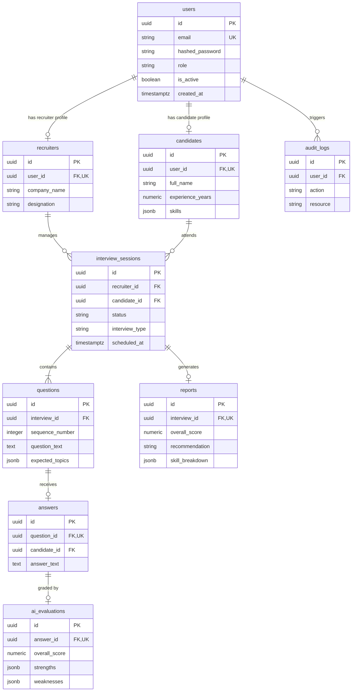

# Database Design & Schema Specifications

## 1. Entity-Relationship (ER) Diagram

---

## 2. Table Schemas & Constraints Summary

### `users`
- Primary Key: `id` (`UUIDv7`)
- Unique Index: `idx_users_email` on `email` WHERE `deleted_at IS NULL`
- Role constraint: `role IN ('CANDIDATE', 'RECRUITER', 'ADMIN')`

### `candidates`
- Foreign Key: `user_id` $\rightarrow$ `users(id)` (1:1 Unique, ON DELETE CASCADE)
- Index: `GIN` index on `skills` (`JSONB`) for fast candidate skill searches.

### `recruiters`
- Foreign Key: `user_id` $\rightarrow$ `users(id)` (1:1 Unique, ON DELETE CASCADE)

### `interview_sessions`
- Foreign Keys: `recruiter_id` $\rightarrow$ `recruiters(id)`, `candidate_id` $\rightarrow$ `candidates(id)`
- Indexes: B-Tree on (`recruiter_id`, `status`), (`candidate_id`, `status`), `scheduled_at`.

### `questions`
- Foreign Key: `interview_id` $\rightarrow$ `interview_sessions(id)` (ON DELETE CASCADE)
- Order Index: Composite B-Tree on (`interview_id`, `sequence_number`).

### `answers`
- Foreign Key: `question_id` $\rightarrow$ `questions(id)` (1:1 Unique, ON DELETE CASCADE)

### `ai_evaluations`
- Foreign Key: `answer_id` $\rightarrow$ `answers(id)` (1:1 Unique, ON DELETE CASCADE)

### `reports`
- Foreign Key: `interview_id` $\rightarrow$ `interview_sessions(id)` (1:1 Unique, ON DELETE CASCADE)

---

## 3. Query Optimization & Indexing Strategy

1. **UUIDv7 Time-Ordered Monotonicity**: Replaces standard UUIDv4 to eliminate B-Tree index fragmentation during high-volume inserts.
2. **Partial Indexes**: Soft delete queries check `WHERE deleted_at IS NULL`, using partial unique indexes to support re-registration without key collisions.
3. **JSONB Indexing**: GIN indexing on `candidates.skills` enables fast execution of candidate filtering queries (`Candidate.skills.contains(['Python'])`).
