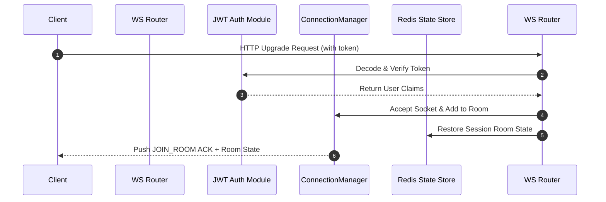

# WebSocket Real-Time Engine Documentation

## 1. Connection Lifecycle & Handshake

WebSocket client connections require JWT authentication in the query parameter during the HTTP upgrade handshake:

```
ws://localhost:8000/ws/interviews/{interview_id}?token=<access_jwt_token>
```



---

## 2. Event Specification Matrix

### Client $\rightarrow$ Server Events
- `JOIN_ROOM`: Explicit room join event.
- `ANSWER_SUBMITTED`: Live answer submission payload (`question_id`, `answer_text`).
- `HEARTBEAT`: Periodic ping frame. Server responds with `PONG`.
- `LEAVE_ROOM`: Clean disconnection signal.

### Server $\rightarrow$ Client Events
- `QUESTION_DELIVERED`: Pushes current question text, sequence number, and total question count.
- `ANSWER_RECEIVED`: Confirms receipt of candidate answer to recruiter socket.
- `EVALUATION_COMPLETED`: Real-time notification pushing AI evaluation scores and feedback to recruiter.
- `REPORT_GENERATED`: Final executive report generation notification.
- `PARTICIPANT_JOINED` / `PARTICIPANT_LEFT`: Participant presence events.

---

## 3. Reconnection & Recovery Protocol

1. **Ping/Pong Heartbeat**: Socket connections send `HEARTBEAT` every 15 seconds. If missed 3 consecutive times, status updates to `DISCONNECTED`.
2. **State Recovery**: Room state is maintained in Redis (`interview_state:{interview_id}`, TTL 4 hours). Upon reconnection within 4 hours, the room recovers `current_question_index` and resumes execution seamlessly.
